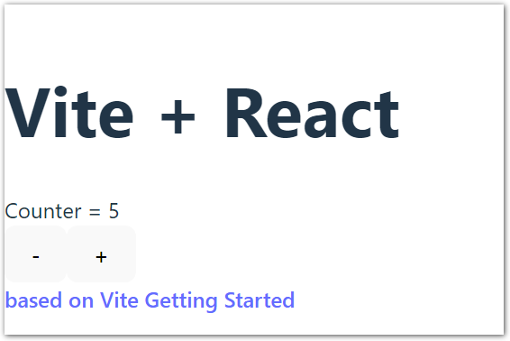

# Simple Vite Getting Started React App

Just a simple project to take a look at [Vite](https://vite.dev). Based on the Vite [Getting Started](https://vite.dev/guide/) guide.

Run `npm run dev` and open http://localhost:5173.

|           | Version |
| --------- | ------: |
| **React** |  18.3.1 |
| **Vite**  |   6.0.3 |

